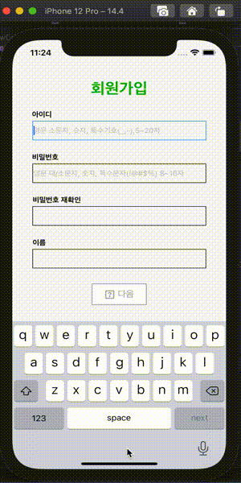

# (회원가입 프로젝트)swift-signup
## Major Implementation
### 1. (branch sign-up) 회원가입 초기 화면 구현 2021.03.31 19:54:12
#### Major features
- [x] 회원가입 화면을 구성한다 
- [x] Place holder로 텍스트 필드의 필요 조건을 표시한다
- [x] TextField Delegate를 뷰 컨트롤러 이외의 파일에 모듈화한다.
- [x] 조건에 맞지 않는 입력값을 확인하여 UI에 반영한다.
- [x] 서버에서 아이디 데이터를 받아 아이디 유효성을 검사한다.
- [x] 요구 입력사항 충족시 다음 화면으로 가는 버튼을 활성화 한다.
- [x] 두번째 Scene으로 넘기는 애니메이션을 코드로 구현한다.

#### Study keywords
- TextField Delegate
- Delegate Pattern
- URLSession
- GCD
- CATransition

#### Display
 

